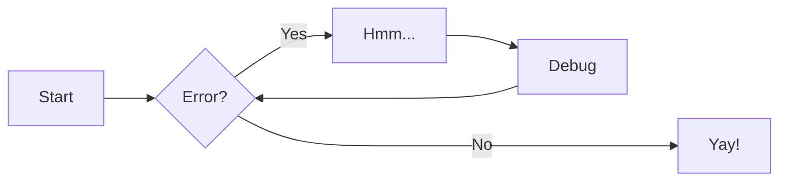

# Diagramme Mermaid

Exemple de [MkDocs Material documentation](https://squidfunk.github.io/mkdocs-material/reference/diagrams/#using-flowcharts): 

> Pensez à actualiser la page pour obtenir l'affichage correct du diagramme